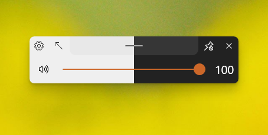
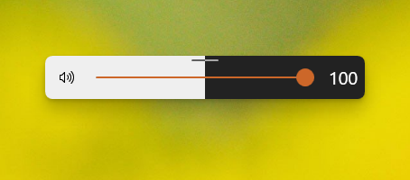
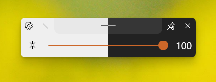
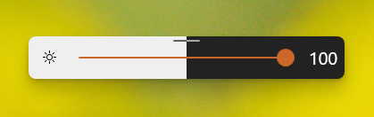
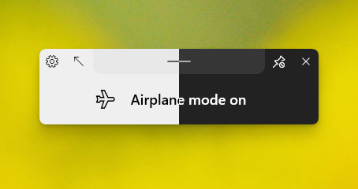
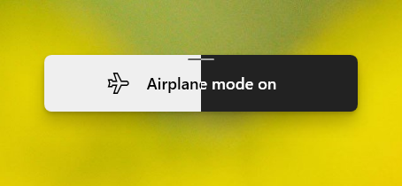
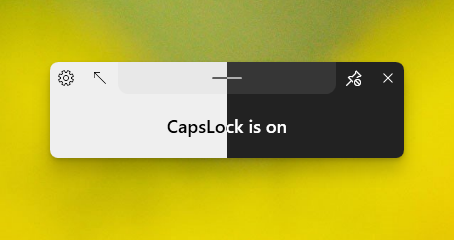
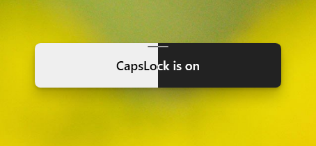

# ModernFlyouts
### A modern replacement for existing flyouts in Windows

[Overview](#overview) | [Features](#features) | [System Requirements](#system-requirements) | [Installation](#installation) | [Screenshots](#screenshots)

## Overview

**Default Flyout:**  &nbsp; &nbsp; &nbsp; &nbsp; &nbsp; &nbsp; &nbsp; &nbsp;  **ModernFlyouts:**

This application will replace the default audio/airplane/brightness flyouts found in Windows shown when the volume or brightness changes or when airplane mode key is pressed with a new fluent UI.

This project is based on [ADeltaX/AudioFlyout](https://github.com/ADeltaX/AudioFlyout). With additional implementation for airplane mode and brightness flyouts. This project also includes a flyout for lock keys (caps lock, scroll lock, num lock & insert key).

> Note : The native flyout is not permanently closed but will be hidden when this flyout is shown
> Thus, users have the freedom to choose between the Windows Default, Modernflyouts' or None.

See the [Wiki](https://github.com/ShankarBUS/ModernFlyouts/wiki) page for additional infos

## Features
- Fluent UI (similar to Windows 10X)
- Follows system theme, user-customizable
- Media session controls have additional options such as **Shuffle**, **Repeat**, **Stop** and **Timeline Info**
- Redesigned audio and brightness flyouts along with additional flyouts for Airplane mode, Lock keys and Insert/Overtype
- Each Module can be disabled separately
- Flyout's TopBar can be pinned, unpinned or hidden.
- Flyout is **Draggable** and autosaves the position. It also has feature for default position. (Check out the settings)
- Smooth **Animations** & **Tranisitions**

## System Requirements
- **Windows 10 1809 and above** (v0.1 - v0.3 support Windows 8 and above, however due to MSIX limitations, v0.4.0 and above won't)

## Installation
Modern Flyouts is Available via GitHub, winget and the [Microsoft Store](https://www.microsoft.com/store/apps/9MT60QV066RP).

All distribution methods will be supported, however the **store version** is **recommended** as it is easier to install and will automatically remain up to date.

### _Microsoft Store:_

Sign up [here](https://forms.office.com/Pages/ResponsePage.aspx?id=DQSIkWdsW0yxEjajBLZtrQAAAAAAAAAAAAMAALdxYU9UQU9GMzQ2Rk40MDJFSkU5UzRKTVg2Nk1PTy4u) for Beta Builds of ModernFlyouts for experimental features
&nbsp;

**Alternatively download from Github:**

1. Go to the [Releases page](https://github.com/ShankarBUS/ModernFlyouts/releases/latest).
2. Download the latest ***.msix** file from the assets.
3. Install the downloaded ***.msix** file and launch the app.

**winget:**

_please note that due to how winget processes package updates, updates may take longer to be released to winget_

`winget install --id=ModernFlyouts.ModernFlyouts -e`

## IMPORTANT NOTE
This project is made possible due to the work of **[ADeltaX](https://github.com/ADeltaX/)**.
I could have improved the original project but the project is called **AUDIO**Flyout and adding airplane-mode/brightness flyouts wouldn't be a good idea, also the project has no recent activity. He's developing a **AudioFlyout**v2 with a refreshed UI. So, I had to make my own with the said additional features.

### Credits
- **[@ADeltaX](https://github.com/ADeltaX/)** laid the foundation for this project and has been a huge support along the way.
- **[@Samuel12321](https://github.com/Samuel12321/)** - package publisher (including **Microsoft Store**), helps maintaining the repo & takes care of issues.

### Dependencies and References 
- [NAudio](https://github.com/naudio/NAudio)
- [ModernWpf](https://github.com/Kinnara/ModernWpf) (That's how I got the name **Modern**Flyouts)
- [Hardcodet.NotifyIcon.Wpf](https://github.com/hardcodet/wpf-notifyicon)

## Screenshots

### Audio Flyout

**Legacy Flyout**

**ModernFlyouts:** 

***Light Theme:***  &nbsp; &nbsp; &nbsp; &nbsp; &nbsp; &nbsp; &nbsp; &nbsp; &nbsp; &nbsp;&nbsp; &nbsp; &nbsp; &nbsp; ***Dark Theme:***

_With TopBar_

_Without TopBar_

&nbsp;

**Legacy SMTC audio playback session**

**ModernFlyouts SMTC audio playback session**

<table>
  <tr>
    <td>SMTC audio playback session</td>
     <td>Audio playback session with additional info</td>
  </tr>
  <tr>
    <td valign="center" halign="center"></td>
    <td valign="center" halign="center"></td>
   </tr>
    <tr>
    <td>Fallback thumbnail for music playback with no album art</td>
     <td>SMTC video playback session with additional info</td>
  </tr>
   <tr>
    <td valign="center" halign="center"></td>
    <td valign="center" halign="center"></td>
  </tr>
 </table>

### Brightness Flyout

<table>
    <td><h4>Legacy Flyout</h4></td>
    <td><h4>ModernFlyouts' (With TopBar)</h4></td>
     <td><h4>ModernFlyouts' (Without TopBar)</h4></td>
  </tr>
   <tr>
    <td valign="center" halign="center"></td>
    <td valign="center" halign="center"></td>
    <td valign="center" halign="center"></td>
  </tr>
 </table>
 &nbsp;

### Airplane-Mode Flyout

**(On state)**

<table>
    <td><h4>Legacy Flyout</h4></td>
    <td><h4>ModernFlyouts' (With TopBar)</h4></td>
     <td><h4>ModernFlyouts' (Without TopBar)</h4></td>
  </tr>
   <tr>
    <td valign="center" halign="center"></td>
    <td valign="center" halign="center"></td>
    <td valign="center" halign="center"></td>
  </tr>
 </table>
 &nbsp;

### Lock-keys flyout

**(Caps-lock On)**

<table>
    <td><h4>Legacy Flyout</h4></td>
    <td><h4>ModernFlyouts' (With TopBar)</h4></td>
     <td><h4>ModernFlyouts' (Without TopBar)</h4></td>
  </tr>
   <tr>
    <td halign="center" valign="center"><h4>Not Available</h4></td>
    <td valign="center" halign="center"></td>
    <td valign="center" halign="center"></td>
  </tr>
 </table>
