# ModernFlyouts
### A modern replacement for existing flyouts in Windows

[Overview](#overview) | [Features](#features) | [System Requirements](#system-requirements) | [Installation](#installation) | [Screenshots](#screenshots)

## Overview

**Default Flyout:**  &nbsp; &nbsp; &nbsp; &nbsp; &nbsp; &nbsp; &nbsp; &nbsp;  **New Flyout:**

This application will replace the default audio/airplane/brightness flyouts found in Windows shown when the volume or brightness changes or when airplane mode key is pressed with a new modern UI.

This project is based on [ADeltaX/AudioFlyout](https://github.com/ADeltaX/AudioFlyout). With additional implementation for airplane mode and brightness flyouts. This project also includes a flyout for lock keys (caps lock, scroll lock, num lock & insert key).

> Note : The native flyout is not permanently closed but will be hidden when this flyout is shown
> Thus, users have the freedom to choose between the windows default one, this modern one or none.

See the [Wiki](https://github.com/ShankarBUS/ModernFlyouts/wiki) page for additional infos

## Features
- Fluent UI (similar to the one in Windows 10X)
- Follows system Light/Dark theme
- Media session controls have additional features such as **Shuffle**, **Repeat**, **Stop** and **Timeline Info**
- AirplaneMode-flyout Module
- LockKeys-flyout Module
- Brightness-flyout Module
- Each Module can be disabled separately
- Can Choose either Windows Default Flyout, ModernFlyouts or None
- Flyout's TopBar can be unpinned
- Flyout is **Draggable** and autosaves the position
- Flyout can be **aligned to a default position** (can be modified in the settings)
- Smooth **Animations** & **Tranisitions**
- This application works on **Windows 10 1809 and above** (v0.3.0 supports Windows 8+, however to simplify distribution and due to MSIX packaging limitations, v0.4.0+ won't support windows versions less than 1809)

## System Requirements
- Windows 10 1809+
- Make sure you have .NET Framework 4.8 runtime installed on your machine.

## Installation
Modern Flyouts is Available on GitHub, winget and the [Microsoft Store](https://www.microsoft.com/store/apps/9MT60QV066RP).

Both distribution methods will be supported, however the store version is recommended as it is easier to install and will automatically remain up to date.

### Microsoft Store:

**Alternatively download from Github:**

1. Go to the [latest releases' page](https://github.com/ShankarBUS/ModernFlyouts/releases/latest).
2. Download the latest ***.msix** file from the assets.
3. Install the downloaded ***.msix** file and launch the app.

**winget:**

*please note that due to how winget processes package updates, updates may take longer to be released to winget*

winget install --id=ModernFlyouts.ModernFlyouts -e

## IMPORTANT NOTE
This project is made possible due to the work of **[ADeltaX](https://github.com/ADeltaX/)**.
I could have improved the original project but the project is called **AUDIO**Flyout and adding airplane-mode/brightness flyouts wouldn't be a good idea, also the project has no recent activity. He's developing a **AudioFlyout**v2 with a refreshed UI. So, I had to make my own with the said additional features.

### Credits
- **[@ADeltaX](https://github.com/ADeltaX/)** laid the foundation for this project and has been a huge support along the way.
- **[@Samuel12321](https://github.com/Samuel12321/)** - package publisher (including **Microsoft Store**), helps maintaining the repo & takes care of issues.

### Dependencies and References 
- [NAudio](https://github.com/naudio/NAudio)
- [ModernWpf](https://github.com/Kinnara/ModernWpf) (That's how I got the name **Modern**Flyouts)
- [Hardcodet.NotifyIcon.Wpf](https://github.com/hardcodet/wpf-notifyicon)

## Screenshots

### Audio Flyout

**Windows Default One**

**Dark Theme :** 

_With TopBar_

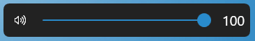

_Without TopBar_

**Light Theme :** 

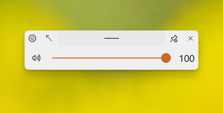

_With TopBar_

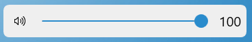

_Without TopBar_

**SMTC audio playback session in old one**

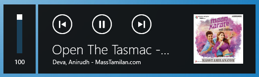

**SMTC audio playback session**

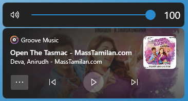

**SMTC audio playback session with additional info**

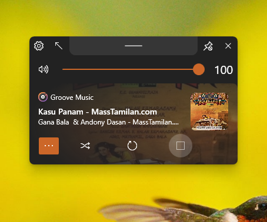

**Fallback thumbnail for music playback with no album art**

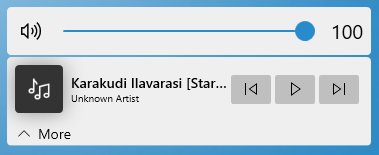

**SMTC video playback session with additional info**

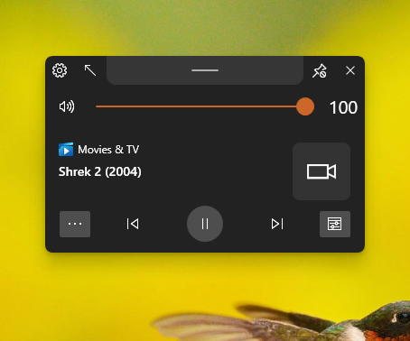

### Brightness Flyout

**Windows Default One**

**Dark Theme :** 

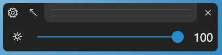

_With TopBar_

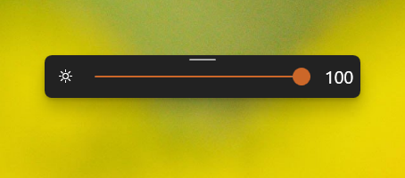

_Without TopBar_

**Light Theme :** 

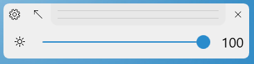

_With TopBar_

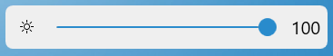

_Without TopBar_

### Airplane-Mode Flyout

**Dark Theme : (On state)**

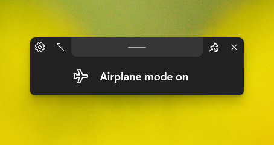

_With TopBar_

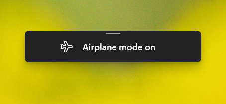

_Without TopBar_

**Light Theme : (On state)**

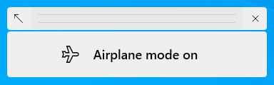

_With TopBar_

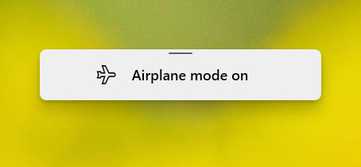

_Without TopBar_

### Lock-keys flyout

**Dark Theme : (Caps-lock On)**

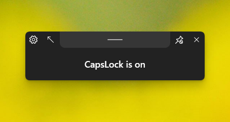

_With TopBar_

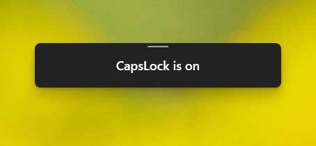

_Without TopBar_

**Light Theme : (Caps-lock On)**

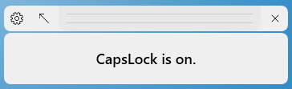

_With TopBar_

_Without TopBar_
