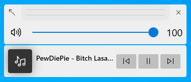

# ModernFlyouts
### A modern replacement for existing flyouts in Windows

**Dark Theme :** 

**Light Theme :** 

**Default one**

This application will replace the default audio/airplane flyouts found in Windows shown when the volume changes or when airplane mode key is pressed.

This project is based on [ADeltaX/AudioFlyout](https://github.com/ADeltaX/AudioFlyout). I have implemented airplane mode flyout as an addition. I have also added a flyout for lock keys (caps lock, scroll lock & num lock).

> Note : The native flyout is not permanently closed but will be hidden when this flyout is shown
> Thus, only audio/airplane-mode flyouts will replace the old one. For **Brightness flyout** the old one is shown.

## Features (new ones compared to [ADeltaX/AudioFlyout](https://github.com/ADeltaX/AudioFlyout).)
- Follows system Light/Dark theme (the theme that taskbar has and not **App Theme**)
- AirplaneMode-flyout Module
- LockKeys-flyout Module
- Note : **Brightness flyout** is not yet implemented and will show the existing one in Windows
- Each Module can be disabled separately.
- Can Choose either Windows Default Flyout, ModernFlyouts or None.
- Flyout is **Draggable**
- Flyout can **aligned to default position**
- **Slide Animation** when hide & showing
- And finally this application works in **all versions of Windows 10** 🎉🎉🎉 (and also tested on Windows 8) (fallback method is added for **SMTC** and not restricted to Windows 10 17763+)
- Supports both .NET 4.6.2 & .NET Core 3.1

## Disadvantages compared to [ADeltaX/AudioFlyout](https://github.com/ADeltaX/AudioFlyout).
- Flyout can't be shown in **LockScreen** and above **TaskManager**, since UIAccess is not taken into account from the beginning.
- No flyout to control **Brightness** due to technical difficulties (can't find the perfect API that works for every laptop device, there are multiple APIs such as `WmiMonitorBrightnessMethods` and `SetDeviceGammaRamp`, can't find the trigger method to show the flyout 😅) and is planned for later.
- No **Acrylic** backdrop (will cost animation so ...)

## IMPORTANT NOTE :
This project is made possible because of the legend **[ADeltaX](https://github.com/ADeltaX/)**.
Hey @ADeltaX, I respect you man 😙. I could have made changes to the original project but the project is called **AUDIO**Flyout and adding airplane-mode to it seemed silly 😅, also the project has no recent activity. He's a legendary dev, I thought he know what he's doing. He's doing a **AudioFlyout**v2 with a new UI. So, I had to make my own with the said additional features.

This project depends on : 
- [NAudio](https://github.com/naudio/NAudio)
- [ModernWpf](https://github.com/Kinnara/ModernWpf) (That's how I got the name **Modern**Flyout)
- Hardcodet.NotifyIcon.Wpf

## Screenshots

**Fallback thumbnail for music playback with no album art**

**Fallback thumbnail for video playback with no thumbnail**

**Airplane-Mode Flyout**

**Lock key flyout**

