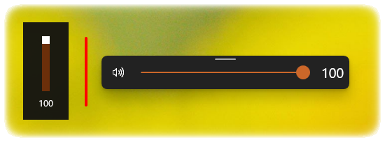

#### An open source, modern, **Fluent Design-based** set of flyouts for Windows.

[Overview](#overview--) • [Features](#features--) • [System Requirements](#system-requirements--%EF%B8%8F) • [Installation](#installation--%EF%B8%8F) • [Connect with us](#connect-with-us--) • [Contributing](#contributing--) • [Screenshots](#screenshots--)

## Overview  👀

**Default Flyout** | **ModernFlyouts**

This application aims to provide a **Fluent Design System** based replacement for the old, built-in, **Metro Design** based **Audio/Airplane mode/Brightness** flyouts in **Windows** ~~*(which haven't been updated since Windows 8 LOL)*~~ *(Bruh moment: MS will likely update them in Windows 11 😭)* which are shown while pressing the media or volume keys or even the brightness keys *(may be absent on Desktop PCs)* or when airplane/flight mode is toggled.

In case of Windows 11, this application will have the same UI but will provide additional features and customizability compared to the built-in redesigned flyouts.

This project has its roots in the app [AudioFlyout](https://github.com/ADeltaX/AudioFlyout) by [ADeltaX](https://github.com/ADeltaX/).
With additional implementations for **"Airplane mode"**, **"Brightness"** and **"LockKeys"** *(includes Insert key, Caps, Num & Scroll lock keys)* flyouts, this project stands as a complete replacement for the built-in flyouts.

> Note : The built-in flyout will not be permanently affected. It will be hidden temporarily while this application is running. So, no reason to fear breaking your system.
> For more information on how to recover the original flyouts, check out [this How To page](https://github.com/ModernFlyouts-Community/ModernFlyouts/wiki/How-To).

> Users are provided the freedom to choose between the Windows built-in flyouts or modern flyouts from ModernFlyouts or neither of them.

> It is impossible to have a flyout for the keyboard backlight brightness or the function (Fn) key because they are not passed as keys but as hardware signals (which the OEMs decide).  Any OS can receive those signals if they have the required driver.

### Please check out [the Wiki](https://github.com/ModernFlyouts-Community/ModernFlyouts/wiki) for additional information, guides and how-tos.

### Please check out [this document](docs/GSMTC-Support-And-Popular-Apps.md) for support regarding your media player/browser.

------------------------

## Features  ✨

- Fluent Design based UI.
- Supports **Light** and **Dark** mode.
- Redesigned **Volume + Media**, **Brightness** and **Airplane mode** flyouts.
- Media Controls have support for (not all app support the whole feature set. [More on this](docs/GSMTC-Support-And-Popular-Apps.md))
  - **Shuffle**,
  - **Repeat**,
  - **Stop**
  - and **Timeline Info**.
- Additional flyouts **Lock keys** and **Insert/Overtype**.
- Each module can be **disabled individually**.
- Fully customizable layout settings, i.e.
  - Auto or Manual Placement mode,
  - Flyout Alignment,
  - Flyout content stacking direction.
- Flyout's TopBar can be pinned, unpinned or hidden.
- Flyout is **Draggable** and autosaves the position. It also has feature for default position. (Check out the settings)
- Supports multi-monitor setup and users can select which monitor to show the flyout on.
- Smooth **Animations** & **Transitions**.
- **Opacity** of the background of flyouts can be changed.
- **Timeout** of flyouts is customizable.

------------------------

## System Requirements  🖥️
- **Windows 11**
- **Windows 10 1809 and above** 
> older versions such as [v0.3](https://github.com/ModernFlyouts-Community/ModernFlyouts/releases/tag/v0.3.0) and below support Windows 10 1803 downlevel till Windows 8, however v0.4 and above won't.

------------------------

## Installation  ⬇️

Modern Flyouts is available for you to install via  [Microsoft Store](https://www.microsoft.com/store/apps/9MT60QV066RP), [GitHub](https://github.com/ModernFlyouts-Community/ModernFlyouts/releases/latest), winget and [Chocolatey](https://chocolatey.org/packages/modernflyouts).

All the distribution methods mentioned above are supported, however installing the app from the **Microsoft Store** is **recommended** as it is easier to install and will automatically remain up to date.

**Microsoft Store**

**GitHub**

1. Go to the [latest release on the Releases page](https://github.com/ModernFlyouts-Community/ModernFlyouts/releases/latest).
2. Download the latest ***.msixbundle** file and the [latest available] **.cer** file from the assets.
3. Install the certificate into the Trusted People directory.
4. Install the downloaded ***.msixbundle** file and launch the app from the **Start Menu**.

**winget**

_please note that due to how winget processes package updates, updates may take **longer** to be released to winget_.

`winget install --id=ModernFlyouts.ModernFlyouts -e`

**Chocolatey**

ModernFlyouts is **unofficially** available to install via Chocolatey [here](https://chocolatey.org/packages/modernflyouts), however as this is not maintained by us we can not verify its security or its update status.

------------------------

## Connect with us  🌐

You can join our [Discord Server](https://discord.gg/TcYskeyaYE) or [Telegram Group](https://t.me/ModernFlyouts) to connect with us. By doing so, we can have off-topic conversations, news about this app, development previews and providing & collecting feedback.

------------------------

## Contributing  🤝

This project welcomes all types of contributions such help planning, design, documentation, finding bugs are ways everyone can help on top of coding features/bug fixes. We are excited to work with the community to make this project reach its goals and beyond.

We ask that **before you start to work on a feature/bug fix that you would like to see happen**, please read [the Contributor's Guide](CONTRIBUTING.md). We will be happy to work with you to figure out the best approach, provide guidance and mentorship throughout the feature development, and help avoid any wasted or duplicate effort.

For guidance on developing for ModernFlyouts, please read [the developer guide](docs/developer_guide.md) for a detailed breakdown. This includes how to setup your computer to build and run the app.

------------------------

## NOTES 🗒️

### Credits

First of all, we must thank our good friend **[ADeltaX](https://github.com/ADeltaX/)** for one of his marvelous works **[AudioFlyout](https://github.com/ADeltaX/AudioFlyout)**. Since the project was stale for a while and it lacked support for brightness and airplane mode flyouts, this project was born. He not only let us use his source code but also helped us improve this app. And he still supports us 😄.
I must admit that this project wouldn't be here *how it is* without **[ADeltaX](https://github.com/ADeltaX/)**. Our heartful thanks to him ❤.

We must also say a big thanks to [our contributors](https://github.com/ModernFlyouts-Community/ModernFlyouts/graphs/contributors) for helping us with some important bug fixes, adding features and localization.

### Our Team 

- **[ShankarBUS](https://github.com/ShankarBUS/)** - Ex-Maintainer/co-owner & Developer.
- **[ADeltaX](https://github.com/ADeltaX/)** - Maintainer & Developer (Our savior! Helps us at critical times.)
- **[Samuel12321](https://github.com/Samuel12321/)** - Maintainer/co-owner of this repository and application publisher (including **Microsoft Store**).
- **[Cyberdroid1](https://github.com/Cyberdroid1)** - Maintainer.

### Dependencies and References

- [NAudio](https://github.com/naudio/NAudio)
- [ModernWpf](https://github.com/Kinnara/ModernWpf) (Inspired the name **Modern**Flyouts)
- [Hardcodet.NotifyIcon.Wpf](https://github.com/hardcodet/wpf-notifyicon)

------------------------

## Beta Builds  🚧

The ability to signup for beta builds has been temporarily disabled while we work on a better way to release and manage them. Beta builds will still occasionally be available to download fron the releases tab on github. Thank to everyone who help us test new releases and find bugs before they go public.

------------------------

## Screenshots  📷

Screenshots are temporarily removed 😅. They will be restored during v1.0 release cycle.
